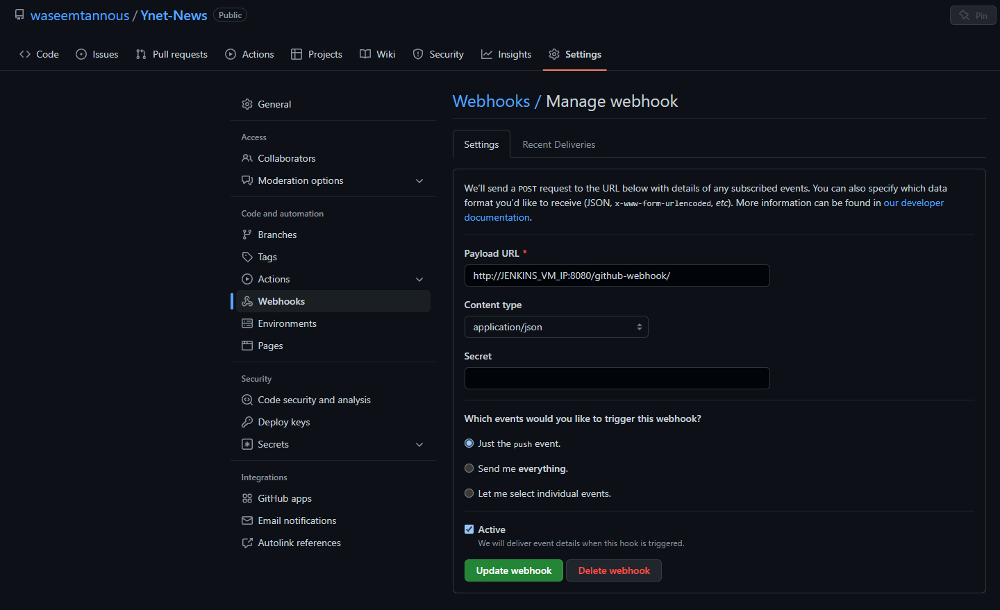
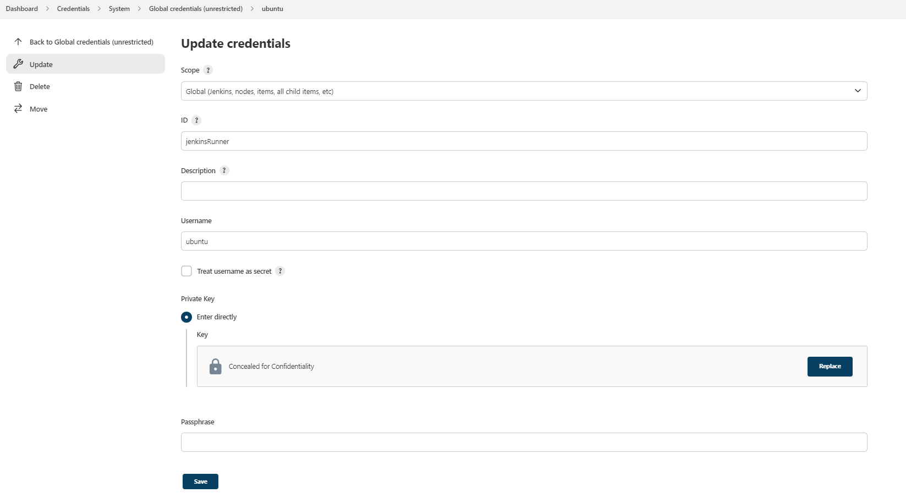
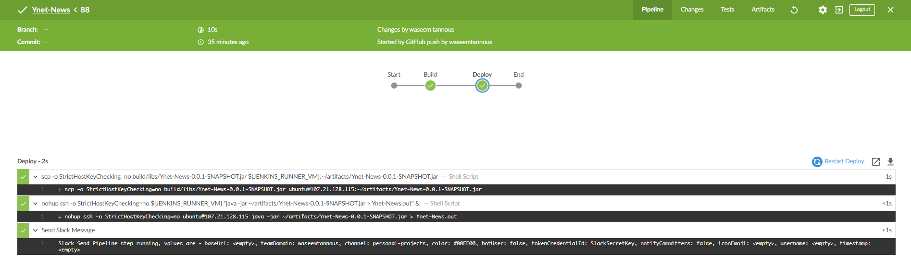
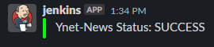
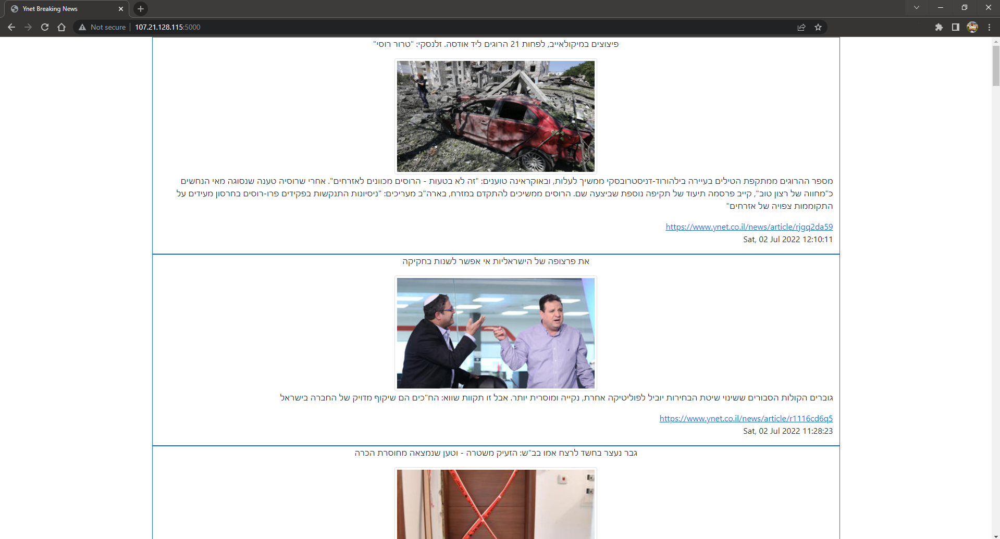

# Ynet News

Ynet news web app using spring boot, built and deployed using jenkins on AWS EC2 instances.


The app reads the “Breaking News” from Ynet news service, then parses and presents the breaking
news XML in an HTML Format. Link to "Ynet Breaking News": http://www.ynet.co.il/Integration/StoryRss2.xml

The app is built using Jenkins on AWS EC2 instance and deployed to another instance using ssh. Jenkins notifies about the build status using Slack.

## Jenkins Plugins

For this project, multiple Jenkins plugins were used:

- [Slack Notification](https://plugins.jenkins.io/slack/) : to send build status to Slack.
- [SSH Agent](https://plugins.jenkins.io/ssh-agent/) : to deploy the app to another instance.

## Build and Deploy

First, create a github webhook so that Jenkins pulls and runs the pipeline on each push to the repo.



To build and deploy, setup Slack notification plugin and add SSH credentials for the runner instance.



Next, edit the Jenkinsfile and change the credentials to your runner instance credentials id on line 15. Also on line 16, change the USER@IP to match your runner instance.

Now, create a new Jenkins job using the Jenkinsfile in this repo and run it.

The Jenkins master sends the build status to Slack and sends the artifacts to the runner instance to run it.

Finally, use your browser to connect to the runner instance on port 5000 to see the output website.

### Blue Ocean Build Status


### Slack Message


## Stop App
To stop the app, ssh to the runner instance and run the following command:

```sh
ps -ef | grep java | grep java | awk '{print $2}' | xargs kill -9
```

## Website Demo

